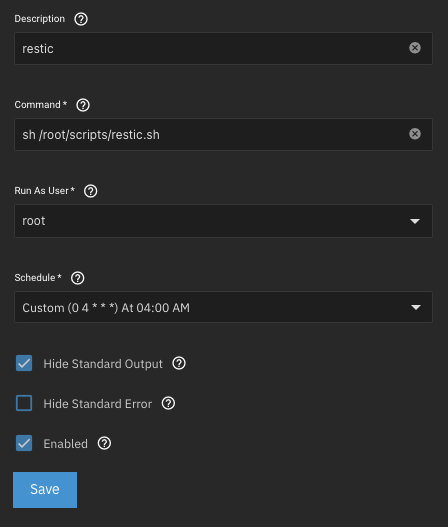

+++
title = 'Backups mit restic von Trunas Scale auf Hetzner Storage Box'
date = 2025-03-02T12:19:40+01:00
tags = ["Backup"]
draft = false
+++

Bis vor Kurzem hatte ich keine durchdachte Backup-Strategie für mein NAS. Ich replizierte die Daten lediglich auf eine externe Festplatte, die sich ebenfalls in meiner Wohnung befindet – also die einzige Kopie meiner Daten.

Inzwischen nutze ich mein NAS produktiv und speichere dort bevorzugt wichtige Daten. Daher benötige ich eine zuverlässige Methode, um diese Daten verschlüsselt in die Cloud zu sichern und im Falle eines Ausfalls wiederherstellen zu können.

Hierfür habe ich mich für **restic** entschieden.

---

### Warum restic?

- **Sicherheit:** Standardmäßige Verschlüsselung der Backups
- **Effizienz:** Deduplizierung spart Speicherplatz und Bandbreite
- **Einfachheit:** Intuitive Nutzung über die Kommandozeile
- **Automatisierbarkeit:** Leicht in Skripte oder Cronjobs integrierbar
- **Flexibilität:** Unterstützung verschiedener Protokolle zur Datenübertragung (SFTP, REST, Rsync)


### Installation von restic auf TrueNAS Scale

Da TrueNAS Scale ein geschlossenes System ist, kann restic nicht über einen Paketmanager installiert werden. Stattdessen lade ich die aktuelle Version direkt von GitHub herunter.

#### Befehle zur Installation:

```bash
cd /root/
wget https://github.com/restic/restic/releases/download/v0.17.3/restic_0.17.3_linux_amd64.bz2
7z x ./restic_0.17.3_linux_amd64.bz2; rm ./restic_0.17.3_linux_amd64.bz2
mv ./restic_0.17.3_linux_amd64 ./restic
chmod +x ./restic
/root/restic self-update
```

Restic kann nun mit dem Befehl `/root/restic` ausgeführt werden:

### Zugriff auf die Hetzner Storage Box einrichten

Damit restic Backups über SFTP auf die Hetzner Storage Box speichern kann, muss der SSH-Zugriff eingerichtet werden.
1. In **Hetzner Robot** die Storage Box auswählen und SSH-Support aktivieren.
2. Ein Schlüsselpaar mit `ssh-keygen` erstellen.
3. Den öffentlichen Schlüssel auf die Storage Box übertragen:

   ```bash
   cat ~/.ssh/id_rsa.pub | ssh -p23 u000000@u000000.your-storagebox.de install-ssh-key
   ```
   *(Dabei muss `u000000` durch den Benutzername der Storage Box ersetzt werden.)*


### Repository erstellen

Mit folgendem Befehl kann ein neues Backup-Repository auf der Storage Box angelegt werden:

```bash
/root/restic -r sftp:u000000@u000000.your-storagebox.de:/restic/reponame init
```

Nun steht ein leeres Backup-Repository zur Verfügung, in das Backups geschrieben werden können.

### Backups automatisieren

Um die Sicherungen regelmäßig auszuführen, erstelle ich ein Shell-Skript unter `/root/scripts/restic.sh`:

```bash
#!/bin/bash

# restic backup
/root/restic -r sftp:u000000@u000000.your-storagebox.de:/restic/share --password-file "/root/scripts/restic-pass" --tag auto backup /mnt/storage/share;

# restic forget (ältere Snapshots nach definierten Regeln löschen)
/root/restic -r sftp:u000000@u000000.your-storagebox.de:/restic/share --password-file "/root/scripts/restic-pass" forget --prune --keep-tag keep --keep-daily 7 --keep-weekly 4 --keep-monthly 6 --keep-yearly 5;

# Cache bereinigen
/root/restic cache --cleanup;
```

#### Erklärung des Skripts:
1. **Backup ausführen**: Die Daten unter `/mnt/storage/share` werden in das Repository auf der Storage Box gesichert.
2. **Alte Snapshots verwalten**:
   - **Tägliche Snapshots**: 7 Tage aufbewahren
   - **Wöchentliche Snapshots**: 4 Wochen aufbewahren
   - **Monatliche Snapshots**: 6 Monate aufbewahren
   - **Jährliche Snapshots**: 5 Jahre aufbewahren
3. **Cache bereinigen**, um Speicherplatz zu sparen.

Die Datei `/root/scripts/restic-pass` enthält das Passwort für das Repository und ist erforderlich, damit das Skript automatisch läuft.

### Cron-Job für automatische Backups

Damit das Backup-Skript regelmäßig läuft, wird ein Cron-Job eingerichtet.  
Dies geschieht über die **TrueNAS Web-GUI**:

1. Navigiere zu **System > Advanced Settings > Cron Jobs**
2. Einen neuen Cron-Job hinzufügen mit folgendem Befehl:
   
   ```bash
   /bin/bash /root/scripts/restic.sh
   ```
3. Zeitplan: **Täglich um 04:00 Uhr** ausführen.
4. E-Mail-Benachrichtigung aktivieren, um Fehler direkt mitzubekommen.

